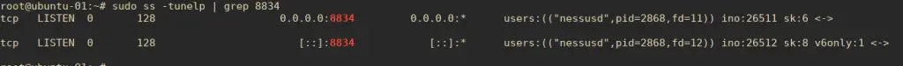
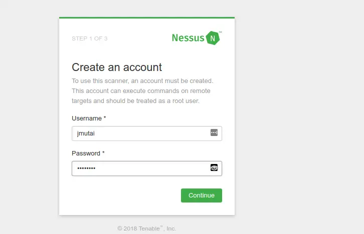
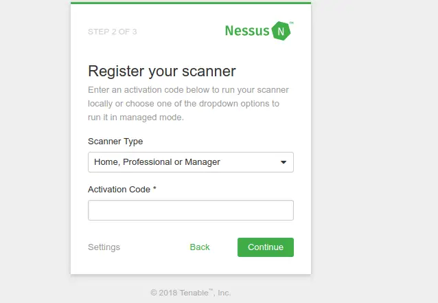
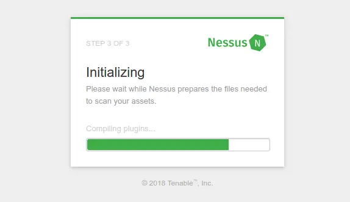
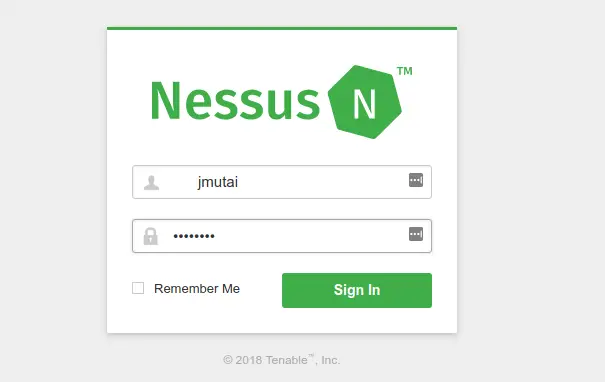
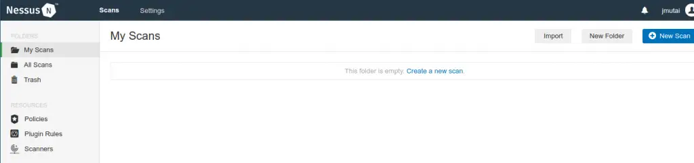

# Install Nessus Scanner on Ubuntu

Nessus is a proprietary vulnerability assessment tool that works for Mobile and Web applications deployed on Premise or in a cloud environment.

Nessus gives you malware detection, scanning of embedded devices, configurations auditing, control systems auditing and compliance checks among other features. Installing  Nessus Scanner on Ubuntu 22.04|20.04|18.04 is the first step to securing and hardening your Infrastructure and Applications from the “bad guys”.

With Nessus, you can audit the following environments:

1. Network devices: firewalls/routers/switches (Juniper, Check Point, Cisco, Palo Alto Networks), printers, storage
2. Virtualization: VMware ESX, ESXi, vSphere, vCenter, Hyper-V, and Citrix Xen Server
3. Operating systems: Windows, Mac, Linux, Solaris, BSD, Cisco iOS, IBM iSeries
4. Databases: Oracle, SQL Server, MySQL, DB2, Informix/DRDA, PostgreSQL, MongoDB
5. Web applications: Web servers, web services, OWASP vulnerabilities
6. Cloud: Scans cloud applications and instances like Salesforce and AWS
7. Compliance: Helps meet government, regulatory and corporate requirements

Meets PCI DSS requirements through configuration auditing, web application scanning

## Step 1: Install Nessus Scanner

Download latest release for Ubuntu:Ezoic

```bash
sudo apt update && sudo apt install curl -y
wget https://www.tenable.com/downloads/api/v2/pages/nessus/files/Nessus-10.5.2-ubuntu1404_amd64.deb
```

For Ubuntu , the package name I’m using is:

Nessus-*-ubuntu1404_amd64.deb

Install it by running:

```bash
$ sudo apt install -f ./Nessus-*-ubuntu1404_amd64.deb
Reading package lists... Done
Building dependency tree... Done
Reading state information... Done
Note, selecting 'nessus' instead of './Nessus-10.5.2-ubuntu1404_amd64.deb'
The following NEW packages will be installed:
  nessus
0 upgraded, 1 newly installed, 0 to remove and 243 not upgraded.
Need to get 0 B/53.3 MB of archives.
After this operation, 0 B of additional disk space will be used.
Get:1 /home/jkmutai/Nessus-10.5.2-ubuntu1404_amd64.deb nessus amd64 10.5.2 [53.3 MB]
Selecting previously unselected package nessus.
(Reading database ... 200072 files and directories currently installed.)
Preparing to unpack .../Nessus-10.5.2-ubuntu1404_amd64.deb ...
Unpacking nessus (10.5.2) ...
Setting up nessus (10.5.2) ...
Unpacking Nessus Scanner Core Components...
Created symlink /etc/systemd/system/nessusd.service → /lib/systemd/system/nessusd.service.
Created symlink /etc/systemd/system/multi-user.target.wants/nessusd.service → /lib/systemd/system/nessusd.service.
```

 - You can start Nessus Scanner by typing /bin/systemctl start nessusd.service
 - Then go to https://jammy:8834/ to configure your scanner


## Step 2: Start and enable nessusd service

 Start nessusd service:

```bash
 sudo systemctl start nessusd
 ```

 Then enable the service to start on boot:

```bash
 $ sudo systemctl enable nessusd.service
 nessusd.service is not a native service, redirecting to systemd-sysv-install.
 Executing: /lib/systemd/systemd-sysv-install enable nessusd
 Confirm service status using:

 $ systemctl status  nessusd.service
 ● nessusd.service - The Nessus Vulnerability Scanner
      Loaded: loaded (/lib/systemd/system/nessusd.service; enabled; vendor preset: enabled)
      Active: active (running) since Thu 2023-06-01 18:36:44 UTC; 12s ago
    Main PID: 5329 (nessus-service)
       Tasks: 14 (limit: 4537)
      Memory: 39.6M
         CPU: 12.964s
      CGroup: /system.slice/nessusd.service
              ├─5329 /opt/nessus/sbin/nessus-service -q
              └─5330 nessusd -q
 ```

Nessus daemon binds to TCP port 8834.


Make sure this port is allowed on firewall if UFW is running:

```bash
sudo ufw allow 8834/tcp
 ```



## Step 3: Configuring Nessus Vulnerability scanner

Visit your Nessus web interface on https://[IP Address|Hostname]:8834 to finish Nessus installation and activation. Create Nessus Administrator Account on the first page.




The License key will be sent to you on email used for signup. Register your Nessus Scanner with emailed activation code.




The Initializing process should start.




Be informed that this could take some time as Nessus download Plugins and prepare the files needed to scan your assets. When done, login with created admin account.



Nessus default page on login should look similar to below.


